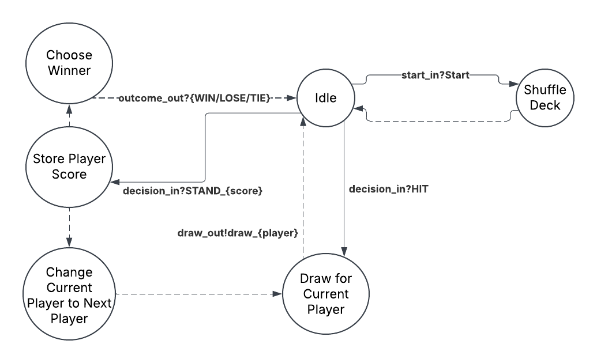

# Controller Atomic Model

## X - Inputs
The possible inputs are Start, to start the game and decisions by the players. 
A player can ask to HIT to draw another card, and stand to stop drawing. 
Stand also reports the final score value of the player.

$$ v \in \mathbb{N} \cap [1,30]$$
$$X = {START, HIT, STAND\_v}$$
Note: Stand also encodes a score value after the underscore, as denoted by $v$.

## S - States
The state of the controller is composed of four components. 
The player currently playing ($s_1$), the challenger's score($s_2$), the dealer's score($s_3$), 
the last input ($s_4$). We add the CHECK_WINNER to $s_4$ to allow to transition to checking the winner internally. 
Finally, the IDLE state is also added to s4 to idle in-between inputs.

$$ s1 \in \{CHALLENGER, DEALER\}$$
$$ s2, s3 \in \mathbb{N} \cap [1,30]$$
$$ s4 \in X \cup \{IDLE, CHECK\_WINNER\}$$
$$ S = \{(s1,s2,s3,s4)\} $$

## Y - Outputs
The controller outputs commands (C), and game outcomes (O).
$$ C = \{SHUFFLE, DRAW\_CHALLENGER, DRAW\_DEALER\}$$
$$ O = \{WIN, TIE, LOSS\}$$
$$ Y = C \cup O $$

## $\delta$int - Internal transitions

$$ \delta_{int}(s)= (\lambda(s),\ 0)$$

## $\delta$ext - External transitions
External inputs simply get stored directly in s4, its purpose is to store the last input. 
We ignore inputs if there already is an input to process, although this should never happen normally. 
It is probably an error in the model in that case.

$$ \delta_{ext}(x, (s1,s2,s3,0))= (s1,s2,s3,x)$$
$$ \delta_{ext}(x, (s1,s2,s3,s4))= (s1,s2,s3,s4)$$

## ta - Time advance function
Note: The time advance is entirely dependent on $s_4$.

$$ \text{if}\ S_{\{\text{_, _, _, START}\}}\ or\ S_{\{\text{_, _, _, HIT}\}}\rightarrow \tau_a = 0 $$
$$ \text{if}\ S_{\{\text{_, _, _, STAND}\}}\ \rightarrow \tau_a = 1$$
$$ \text{if}\ S_{\{\text{_, _, _, CHECK_WINNER}\}}\ \rightarrow \tau_a = 2$$
$$ \text{if}\ S_{\{\text{_, _, _, IDLE}\}}\ \rightarrow \tau_a = inf$$

## $\lambda$ - Output function
Note: We don't handle the IDLE $s_4$ because it has an infinite time advance.
### Check Winner function
This function compares the internal state to determine the game winner
$$ \begin{align}
check\_winner(chal, deal) = \{\ &if\ chal > 21 &then\ LOSE \\
& if\ deal > 21 &then\ WIN \\
& if\ deal = chal &then\ TIE \\
& if\ chal > deal &then\ WIN \\
& if\ chal < deal &then\ LOSE \}
\end{align}
$$

### Output function
$$ \begin{align}
lambda(s) = \{\ &if\ s_4=HIT &then\ DRAW\_(s1) \\
& if\ s_4=START &then\ SHUFFLE \\
& if\ s_4=CHECK\_WINNER\ &then\ check\_winner(s2, s3)\} 
\end{align}
$$