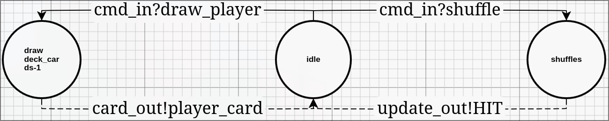

# Deck Formal DEVS Specification

## X - Inputs
{shuffle,draw}
- Shuffle: shuffles the cards in the deck
- draw: draw one card in the deck
## S - States

$$ S = \{(\text{deck},\text{active})\ |\ \text{deck} \subseteq D, \text{active} \in \{\text{idle},\text{draw},\text{shuffle}\}\} $$
- deck: the list of remaining cards
- D: the 52 card standard deck
## Y - Outputs
{A,2,3,4,5,6,7,8,9,10,J,Q,K,updated}

## $\delta_{int}$ - Internal transitions
$$ if\ S_{\{\text{deck},\text{drawing}\}} \rightarrow \text{deck} - 1 \rightarrow S_{\{\text{deck},\text{idle}\}}$$ 
$$ if\ S_{\{\text{deck},\text{shuffle}\}} \rightarrow \text{shuffle deck} \rightarrow S_{\{\text{deck},\text{idle}\}}$$
## $\delta_{ext}$ - External transitions
$$ \delta_{ext}(\text{draw},\{\text{deck},\text{idle}\})} \rightarrow S_{\{\text{deck},\text{draw}\}} $$
$$ \delta_{ext}(\text{shuffle},\{\text{deck},\text{idle}\})} \rightarrow S_{\{\text{deck},\text{shuffle}\}} $$
## ta - Time advance function
$$ \text{if}\ S_{\{\text{deck},\text{idle}\}} \rightarrow \tau_a = \infty $$
$$ \text{if}\ S_{\{\text{deck},\text{draw}\}} \rightarrow \tau_a = 1s $$
$$ \text{if}\ S_{\{\text{deck},\text{shuffle}\}} \rightarrow \tau_a = 10s $$

## $\lambda$ - Output function

$$ \text{if}\ S_{\{\text{deck},\text{draw}\}} \rightarrow draw(deck)$$

- draw(deck) returns any card remaining in the deck equally weighted.
