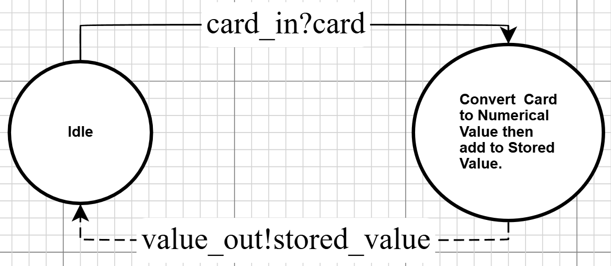

# Hand Atomic Model

## X - Inputs
The possible card ranks that can come into the hand:
$$X = \{A, 2, 3, 4, 5, 6, 7, 8, 9, 10, J, Q, K\}$$

## S - States
States are composed of a stored value (v), and a new unprocessed card (c). 
At any point, the actual hand value is v+c, but it takes some time to calculate and store the value of c.
$$ S = \{(v, c)\} \quad$$
$$v \in \mathbb{N}$$
$$c \in X \cup\{0\}$$

## Y - Outputs
The output is $s'_v$ (see output function / internal transition), 
the addition of the card value and the current stored. It follows that it has the same domain as v.
$$ Y = \{(v)\} \quad
v \in \mathbb{N}$$

## $\delta$int - Internal transitions
Ignore when c = 0, infinite ta. The value needs to reset to 0 everytime it is processed:

$$ \delta_{int}(s)= (\lambda(s),\ 0)$$
Note: $s_v, s_c$ refers to the value component and the card component of the current state.

## $\delta$ext - External transitions
We ignore the elapsed time, should not be relevant. Sets the card in state to the input card.
$$ \delta_{ext}(c, s)= (s_v,\ c)$$
Note: $s_v$ refers to the value component of the current state.

## ta - Time advance function
There are two state categories the time advance cares about: There is an input to evaluate, or there isn't.
If there is, compute the value (compute time, around 0.1 seconds), otherwise, do nothing.
Note: "_" refers to any value (don't care value), we do not need this value to evaluate ta.

### s = (_, 0)
ta = infinite
### s != (_, 0)
ta = compute_time = 0.1s + variation

## $\lambda$ - Output function

### Card Conversion function
There are cards which have their ranks as numbers, 
but there are also special cards which need to be converted to a numerical value.
This function captures this part of the output function process.
$$ \begin{align}
    conv(c) = \{\ &if\ A &then\ 1 \\
    & if\ (J\ or\ Q\ or\ K) &then\ 10 \\
    & else &then \ c \} \\
    \end{align}
$$

### Output function
$$ \lambda(s) = s_v + conv(s_c) $$ 