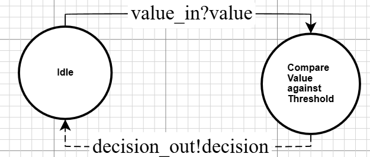

# Threshold DEVS Formal Specification

## X - Inputs
The inputs are the values that are intended to be compared with the internal threshold value. 
The max is 30 in the case that the hand has 20, and gets a 10 value card.
$$ X = x \in \mathbb{N}$$

## S - States
Threshold states are tuples composed of two values: (t, v). t is the threshold value set by the component, static. 
v is the comparison value it receives as an input (+0 for the idle state). Their domain is specified as follows:

$$ S = \{(t,v)\} $$
$$ t \in \mathbb{N} \cap [1, 21]$$
$$ v \in X \cup\{0\}$$

## Y - Outputs
Decisions to take, based on the comparison between the threshold and input value (see output function).
Note: STAND appends the player score at the end which shares the range of $v$.
$$ Y = \{HIT, STAND\_v\} $$
$$ v \in X \cup\{0\}$$

## $\delta_{int}$ - Internal transitions
Ignore when v = 0, infinite ta. The value needs to reset to 0 everytime it is processed:

$$ \delta_{int}(s)= (s_t,\ 0)$$
Note: $s_t$ refers to the threshold value component of the current state.

## $\delta_{ext}$- External transitions
We ignore the elapsed time, should not be relevant. Sets the value in state to the input value.
$$ \delta_{ext}(v, s)= (s_t,\ v)$$
Note: $s_t$ refers to the threshold value component of the current state.

## ta - Time advance function
There are two state categories the time advance cares about: There is an input to evaluate, or there isn't. 
If there is, take a decision (think time, around 0.1 seconds), otherwise, do nothing. 
Note: "_" refers to any value (don't care value), we do not need this value to evaluate ta.

### s = (_, 0)
ta = infinite
### s != (_, 0)
ta = think_time = 0.1s + variation

## $\lambda$ - Output function
Ignore when v = 0, infinite ta. When the value meets the threshold (or above), take the decision to STAND. 
Otherwise, keep hitting (HIT).

$$ \begin{align}
\lambda(s) =\ & \{ if  &s_t > s_v & \quad then\ HIT \\
&\ else && \quad then \ STAND\_v
\end{align}$$ 