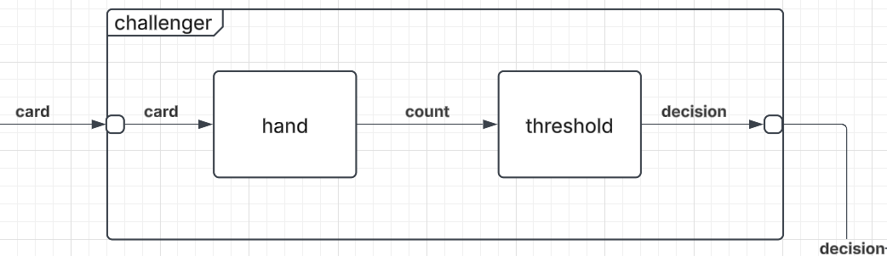

# Challenger Coupled Model

## X - Input
{card}
## Y - Output
{HIT,STAND(count)}

## M - Set of Component Models
{hand, threshold}

## EIC - External Input Couplings
{deck.card(challenger)->hand.card}
## EOC - External Output Couplings
{threshold.HIT->challenger.HIT, threshold.STAND->challenger.STAND}

## IC - Internal Couplings
{hand.count->threshold.count}

## Select

