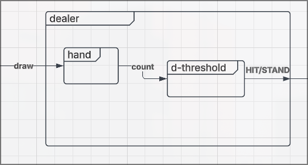

# Dealer Coupled Model

## X - Input
{card}
## Y - Output
{HIT, STAND(count)}
## M - Set of Component Models
{hand, threshold}

## EIC - External Input Couplings
{deck.card(dealer)->hand.card}
## EOC - External Output Couplings
{threshold.HIT->dealer.HIT, threshold.STAND->dealer.STAND}

## IC - Internal Couplings
{hand.count->threshold.count}

## Select

