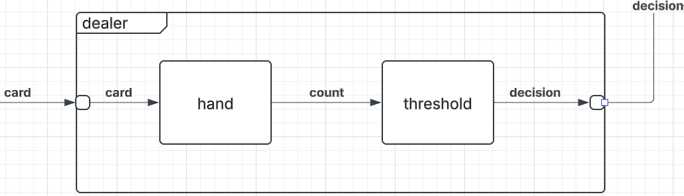

# Dealer Coupled Model

## X - Input
The dealer takes in cards, differentiated by the following ranks:
$$ X = \{A,2,3,4,5,6,7,8,9,10,J,Q,K\} $$
## Y - Output
Outputs the decision it takes at the end of the turn. If they stand, they also report the score at the end (count value).
{HIT,STAND\_count}
$$ count \in \mathbb{N} \cap [1, 30]$$

## M - Set of Component Models
{hand, threshold}

## EIC - [External Input Couplings
{dealer.card->hand.card}
## EOC - External Output Couplings
{threshold.decision->dealer.decision}

## IC - Internal Couplings
{hand.count->threshold.count}

## Select
It's better to take the decision of the previous turn first before processing the updated hand.
That said, you should never be drawing before your turn is ended so if this happens in simulation
something has gone wrong already.

SELECT: ({hand, threshold}) = threshold