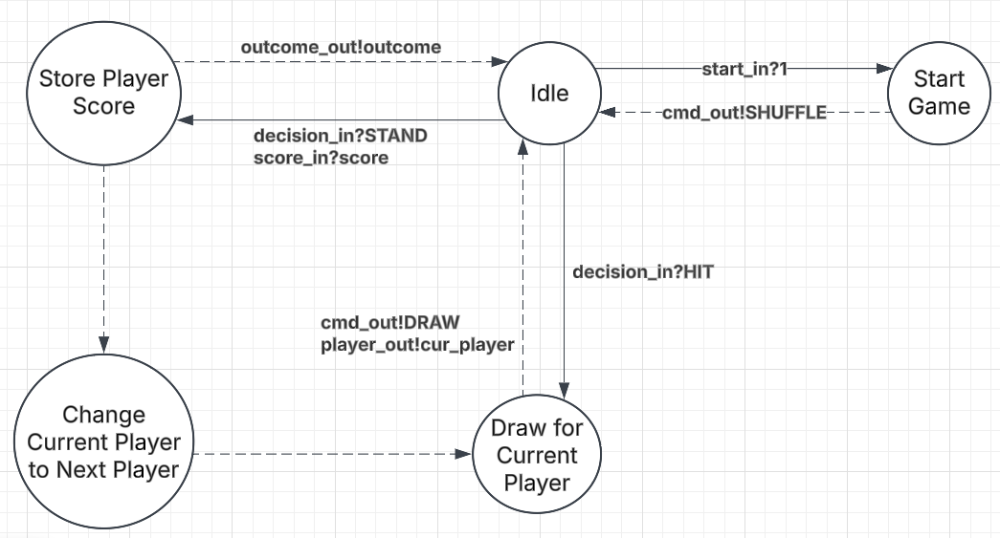

# Controller Atomic Model

## X - Inputs
Start: Input to start the game. 
Decisions: A player can ask to HIT to draw another card, and stand to stop drawing. 
Score: Final score reported when a player stands.

$$X = (start, decision, score)$$
$$ start \in \mathbb{B}$$
$$ decision \in \{HIT, STAND\}$$
$$ score \in \mathbb{N} \cap [1,30]$$

## S - States
The state of the controller is composed of four components. 
The player currently playing ($s_1$), the challenger's score($s_2$), the dealer's score($s_3$), 
the last input ($s_4$). We add the IDLE to s4 to idle in-between inputs.

$$ s1 \in \{CHALLENGER, DEALER\}$$
$$ s2, s3 \in \mathbb{N} \cap [1,30]$$
$$ s4 \in decision \cup \{IDLE\}$$
$$ S = \{(s1,s2,s3,s4)\} $$

## Y - Outputs
The controller outputs commands, and game outcomes. 
It also makes use of players to communicate who to draw for.
$$ Y =  (command, player, outcome)$$
$$ command \in \{SHUFFLE, DRAW\}$$
$$ player \in \{CHALLENGER, DEALER\}$$
$$ outcome \in \{WIN, TIE, LOSS\}$$

## $\delta$int - Internal transitions
The internal transition behaviour is strongly dependent on the value in $s_4$, 
therefore we define $\delta_{int}$ based on it. Note, $s_4$ = IDLE is ignored because of its infinite ta value.

### Check Winner function
This function compares the internal state to determine the game winner.
Note: CONTINUE indicates no winner, game should continue.
$$ \begin{align}
check\_winner(chal, deal) = \{\ 
&if\ chal > 21 &then\ LOSE \\
&if\ deal = 0 &then\ CONTINUE\\
& if\ deal > 21 &then\ WIN \\
& if\ deal = chal &then\ TIE \\
& if\ chal > deal &then\ WIN \\
& if\ chal < deal &then\ LOSE
\}
\end{align}
$$

### $\delta_{int}$
$$ \delta_{int}(\_, \_, \_, START) = (CHALLENGER, 0, 0, IDLE)$$
$$ \delta_{int}(s1, s2, s3, HIT) = (s1, s2, s3, IDLE)$$
$$ \delta_{int}(\_, \_, \_, STAND) = \{if\ check\_winner(s2, s3) != CONTINUE\ then\ (s1, s2, s3, IDLE)\ else\ (DEALER, s2, s3, HIT)\}$$
- For stand, we check if the game should end. Otherwise, it must be the dealer's turn to go next 
(since it's always the challenger, then the dealer's turn to play before ending the game).

## $\delta$ext - External transitions
External inputs simply get stored directly in s4, its purpose is to store the last input. 
We ignore inputs if there already is an input to process, although this should never happen normally. 
It is probably an error in the model in that case.

$$ \delta_{ext}((1, \_, \_), (s1,s2,s3,s4))= (s1,s2,s3,SHUFFLE)$$
$$ \delta_{ext}((0, HIT, _), (s1,s2,s3,s4))= (s1,s2,s3,HIT)$$
$$ \delta_{ext}((0, STAND, value), (CHALLENGER,s2,s3,s4))= (s1,value,s3,STAND)$$
$$ \delta_{ext}((0, STAND, value), (DEALER,s2,s3,s4))= (s1,s2,value,STAND)$$

## ta - Time advance function
Note: The time advance is entirely dependent on $s_4$.

$$ \text{if}\ S_{\{\text{_, _, _, START}\}}\ or\ S_{\{\text{_, _, _, HIT}\}}\rightarrow \tau_a = 0 $$
$$ \text{if}\ S_{\{\text{_, _, _, STAND}\}}\ \rightarrow \tau_a = 1$$
$$ \text{if}\ S_{\{\text{_, _, _, CHECK_WINNER}\}}\ \rightarrow \tau_a = 2$$
$$ \text{if}\ S_{\{\text{_, _, _, IDLE}\}}\ \rightarrow \tau_a = inf$$

## $\lambda$ - Output function
Note: We don't handle the IDLE $s_4$ because it has an infinite time advance. 
We re-use the check_winner function mentioned in the internal transition section

### Output function
Note: _ indicates no output for that port
$$ \begin{align}
lambda(s) = \{\ &if\ s_4=HIT &then\ (DRAW, s_1, \_) \\
& if\ s_4=START &then\ (SHUFFLE, \_, \_)  \\
& if\ s_4=CHECK\_WINNER\ &then\ (\_, \_, check\_winner(s2, s3))\} 
\end{align}
$$