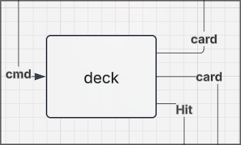

# Deck Formal DEVS Specification

## X - Inputs
 {SHUFFLE, DRAW_CHALLENGER, DRAW_DEALER}
- Shuffle: shuffles the cards in the deck
- draw_X: draw one card in the deck, for the named player (X).
## S - States

$$ S = \{(\text{deck, active})\ |\ \text{deck} \subseteq D, \text{active} \in \{\text{idle, draw, shuffle}\}\} $$
- deck: the list of remaining cards
- D: the 52 card standard deck
## Y - Outputs
{A,2,3,4,5,6,7,8,9,10,J,Q,K,HIT}

## $\delta_{int}$ - Internal transitions
Note: DRAW_X indicates don't care value, either one behaves the same.
$$ \delta_{int}( \{\text{deck, DRAW\_X}\}) \rightarrow \text{deck}-1 \rightarrow S_{\{\text{deck, idle}\}} $$
$$ \delta_{int}(\{\text{deck, shuffle}\}) \rightarrow \text{shuffle deck} \rightarrow S_{\{\text{deck, idle}\}} $$
## $\delta_{ext}$ - External transitions
Note: DRAW_X indicates don't care value, either one behaves the same.
$$ \delta_{ext}(\text{draw},\{\text{deck, idle}\}) \rightarrow S_{\{\text{deck, DRAW\_X}\}} $$
$$ \delta_{ext}(\text{shuffle},\{\text{deck, idle}\}) \rightarrow S_{\{\text{deck, shuffle}\}} $$
## ta - Time advance function
Note: DRAW_X indicates don't care value, either one behaves the same.
$$ \text{if}\ S_{\{\text{deck, idle}\}} \rightarrow \tau_a = \infty $$
$$ \text{if}\ S_{\{\text{deck, DRAW\_X}\}} \rightarrow \tau_a = 1s $$
$$ \text{if}\ S_{\{\text{deck, shuffle}\}} \rightarrow \tau_a = 10s $$

## $\lambda$ - Output function
The draw outputs encode the player to send the card to first, then the card drawn (returned by the drawing function).
When the deck is shuffled, the deck model communicates back to draw immediately from it.

$$ \text{if}\ S_{\{\text{deck, DRAW\_CHALLENGER}\}} \rightarrow CHALLENGER\_draw(deck)$$
$$ \text{if}\ S_{\{\text{deck, DRAW\_DEALER}\}} \rightarrow DEALER\_draw(deck)$$
$$ \text{if}\ S_{\{\text{deck, shuffle}\}} \rightarrow HIT$$

- draw(deck) returns any card remaining in the deck equally weighted.
