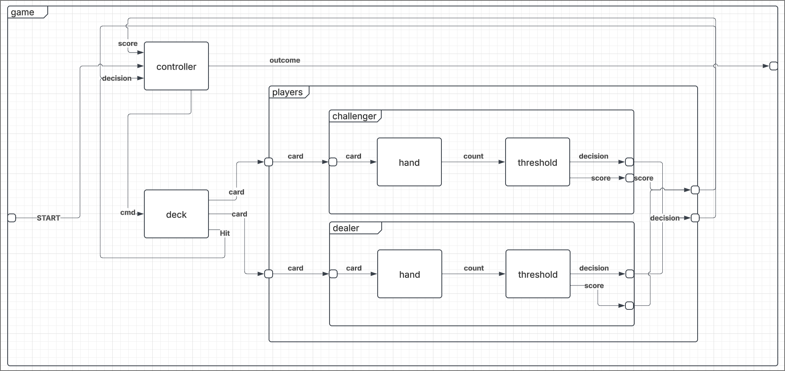

# Game Coupled Model

## X - Input
{start}
## Y - Output
{win,lose,tie}

## M - Set of Component Models
{controller, deck, players}

## EIC - External Input Couplings
{(game.start,controller.start)}

## EOC - External Output Couplings
{(controller.outcome,game.out), (game.gameStartIn,controller.startIn)}

## IC - Internal Couplings
{
 (controller.cmd,deck.cmd),
 (controller.player,deck.player),
 (deck.challengerOut,player.challengerIn),
 (deck.dealerOut,player.dealerIn),
 (deck.hitOut,controller.decision),
 (players.decision,controller.decision),
 (players.scoreOut,controller.scoreIn),
}

## Select:
- It's better to take the decision of the previous turn first before processing the updated hand.
- That said, you should never be drawing before your turn is ended so if this happens in simulation something has gone wrong already.

SELECT: 
- {controller, deck} = deck
- {controller, players} = players
- {deck, players} = players
- {controller, players} = players
- {controller, players, deck} = players
