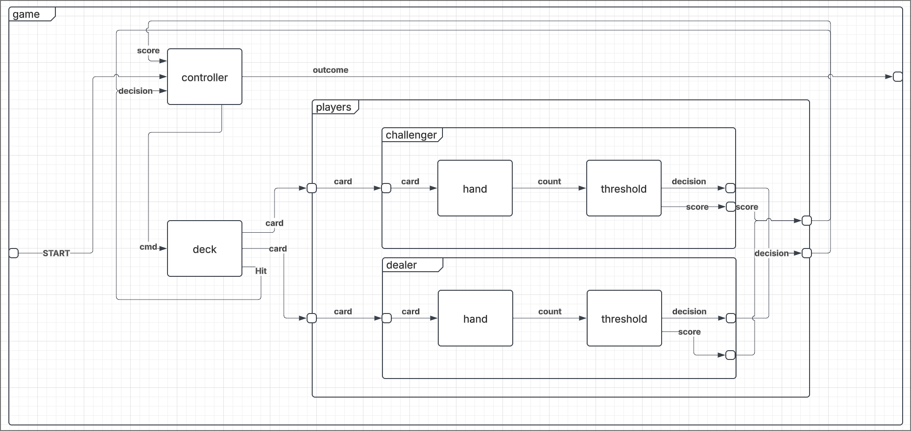
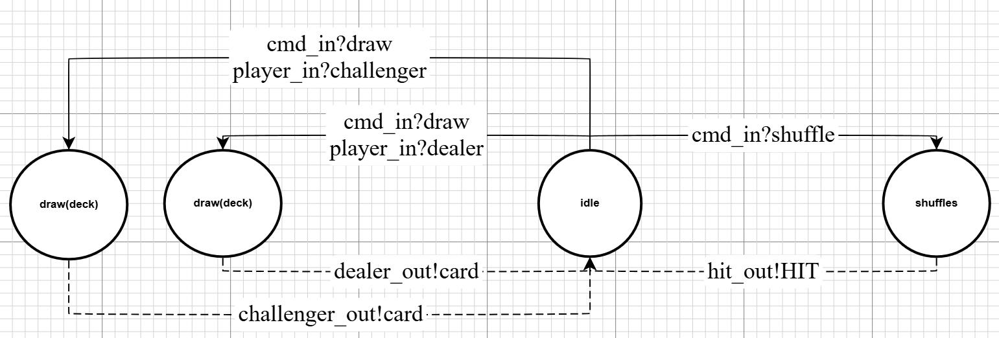
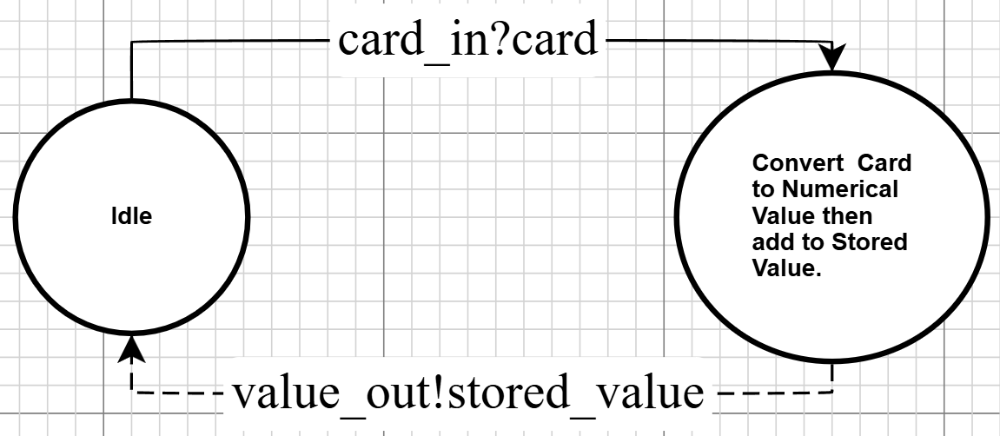
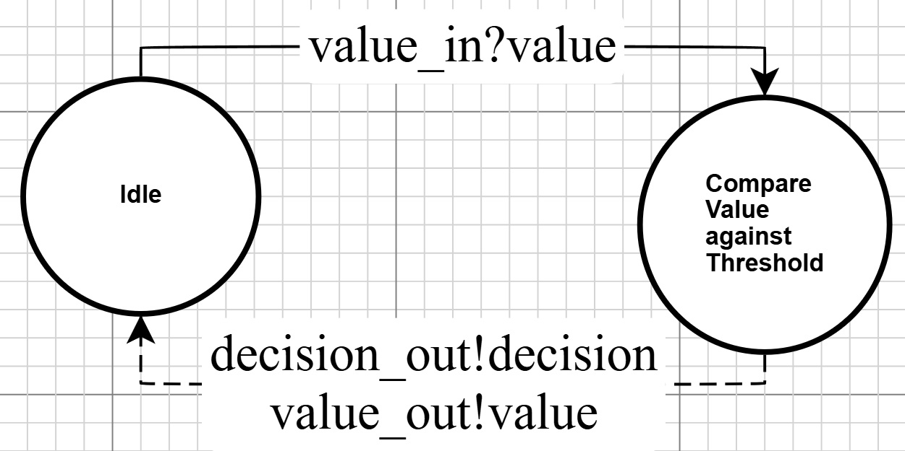
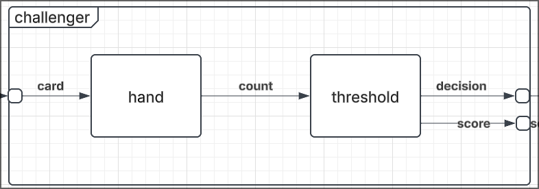
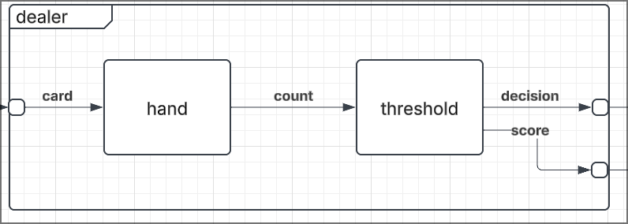
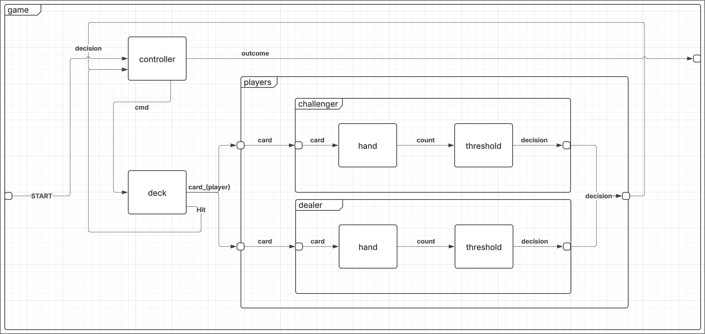
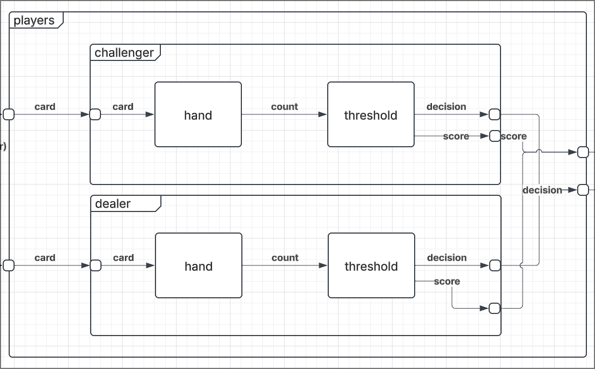

# Final Report

## Authors
| Name | Student number |
|-|-|
| Arthur Atangana | 101005197 |
| Alexandre Marques | 1234 |
## Execution Instruction
1. Precondition: Cadmium v2 is installed on the system. Otherwise, look at: Cadmium v2 install manual
2. Clone repo: 
```` https://github.com/ArthurAtangana/blackjack-simulation.git ````
3. Build, by executing: ````build_sim.sh````
4. Run simulation, by executing: ````scripts/game.sh````
5. Run other submodel tests (if desired), by executing other scripts in the "scripts" folder. Read scripts.md to see the purpose of each script. 

## BlackJack Conceptual Model
### Problem Description

- We would like to model the card game called BlackJack. The goal of the game is to get the closest to a hand value of 21 without going over. Face cards are worth 10, aces 1, and all other cards their face value.
- In our version of the game, each player takes their turn sequentially. A player starts their turn by receiving two cards. Afterwards, a player can decide to HIT or STAND. If the player hits, they draw a card, and they can again make a decision to HIT or STAND. This continues until the player stands (ends their turn) or busts (goes over 21, and loses the turn). The dealer goes after the player and behaves in the same way except they have a specific fixed threshold where they are forced to stand. If the dealer stands (did not bust), the hands are compared and the highest hand wins. It is possible to tie if the hands are equal.
- For simplicity, we will ignore some aspects of the real game. We do not model bets, as they would not impact the outcome of the game itself. We are currently thinking of excluding the ace rule where they can be worth 1 or 11 depending on the state of the hand. In our current conceptual model, they would simply be valued at one.

### Model


### Component Description
- **Game**: The component representing the game itself. It contains Deck, Game Controller, and Players components.
- **Deck**: Has the cards of the game, can be shuffled and distributes cards one at a time.
- **Controller**: Keeps track of the game states, who is playing and who wins at the end.
- **Players**: A coupled model of all players in the game, including the dealer and the challenger.
- **Dealer**: The dealer of the game, follows special rules compared to normal players. Has a Hand and Threshold atomic model (threshold = 17).
- **Challenger**: Draws cards to reach a total up to 21. Can decide to stop drawing cards ending its turn. Has a Hand and Threshold atomic model (threshold = 15).
- **Hand**: Holds the hand of a specific player, receives a card and outputs the current hand value.
- **Threshold**: The decision making model, takes in the current hand value and chooses to HIT or STAND (stop drawing) depending on a threshold value. The dealer’s threshold is fixed to 17, while other players can choose (set to 15 in our model for the Challenger).

## DEVS Formal Specifications
### Atomic Models
#### Controller


##### X - Inputs
Start: Input to start the game. 
Decisions: A player can ask to HIT to draw another card, and stand to stop drawing. 
Score: Final score reported when a player stands.

$$ X = (start, decision, score)$$
$$ start \in \mathbb{B}$$
$$ decision \in \{HIT, STAND\}$$
$$ score \in \mathbb{N} \cap [1,30]$$

##### S - States
The state of the controller is composed of four components. 
The player currently playing ($s_1$), the challenger's score($s_2$), the dealer's score($s_3$), 
the last input ($s_4$). We add the IDLE to s4 to idle in-between inputs.

$$ s1 \in \{CHALLENGER, DEALER\}$$
$$ s2, s3 \in \mathbb{N} \cap [1,30]$$
$$ s4 \in decision \cup \{IDLE\}$$
$$ S = \{(s1,s2,s3,s4)\} $$

##### Y - Outputs
The controller outputs commands, and game outcomes. 
It also makes use of players to communicate who to draw for.
$$ Y =  (command, player, outcome)$$
$$ command \in \{SHUFFLE, DRAW\}$$
$$ player \in \{CHALLENGER, DEALER\}$$
$$ outcome \in \{WIN, TIE, LOSS\}$$

##### $\delta_{int}$ - Internal transitions
The internal transition behaviour is strongly dependent on the value in $s_4$,
therefore we define $\delta_{int}$ based on it. Note, $s_4$ = IDLE is ignored because of its infinite ta value.

###### Check Winner function
This function compares the internal state to determine the game winner.
Note: CONTINUE indicates no winner, game should continue.
$$ \begin{align}
check\_winner(chal, deal) = \{\ 
&if\ chal > 21 &then\ LOSE \\
&if\ deal = 0 &then\ CONTINUE\\
& if\ deal > 21 &then\ WIN \\
& if\ deal = chal &then\ TIE \\
& if\ chal > deal &then\ WIN \\
& if\ chal < deal &then\ LOSE
\}
\end{align}
$$

###### $\delta_{int}$
$$ \delta_{int}(\_, \_, \_, START) = (CHALLENGER, 0, 0, IDLE)$$
$$ \delta_{int}(s1, s2, s3, HIT) = (s1, s2, s3, IDLE)$$
$$ \delta_{int}(\_, \_, \_, STAND) = \{if\ check\_winner(s2, s3) != CONTINUE\ then\ (s1, s2, s3, IDLE)\ else\ (DEALER, s2, s3, HIT)\}$$
- For stand, we check if the game should end. Otherwise, it must be the dealer's turn to go next 
(since it's always the challenger, then the dealer's turn to play before ending the game).

##### $\delta$<sub>ext</sub> - External transitions
External inputs simply get stored directly in s4, its purpose is to store the last input. 
We ignore inputs if there already is an input to process, although this should never happen normally. 
It is probably an error in the model in that case.

$$ \delta_{ext}((1, \_, \_), (s1,s2,s3,s4))= (s1,s2,s3,SHUFFLE)$$
$$ \delta_{ext}((0, HIT, \_), (s1,s2,s3,s4))= (s1,s2,s3,HIT)$$
$$ \delta_{ext}((0, STAND, value), (CHALLENGER,s2,s3,s4))= (s1,value,s3,STAND)$$
$$ \delta_{ext}((0, STAND, value), (DEALER,s2,s3,s4))= (s1,s2,value,STAND)$$

##### ta - Time advance function
Note: The time advance is entirely dependent on $s_4$.

$$ \text{if}\ S_{\{\text{_, _, _, START}\}}\ or\ S_{\{\text{_, _, _, HIT}\}}\rightarrow \tau_a = 0 $$
$$ \text{if}\ S_{\{\text{_, _, _, STAND}\}}\ \rightarrow \tau_a = 1$$
$$ \text{if}\ S_{\{\text{_, _, _, CHECK_WINNER}\}}\ \rightarrow \tau_a = 2$$
$$ \text{if}\ S_{\{\text{_, _, _, IDLE}\}}\ \rightarrow \tau_a = inf$$

##### $\lambda$ - Output function
Note: We don't handle the IDLE $s_4$ because it has an infinite time advance. 
We re-use the check_winner function mentioned in the internal transition section

##### Output function
Note: _ indicates no output for that port
$$ \begin{align}
lambda(s) = \{\ &if\ s_4=HIT &then\ (DRAW, s_1, \_) \\
& if\ s_4=START &then\ (SHUFFLE, \_, \_)  \\
& if\ s_4=CHECK\_WINNER\ &then\ (\_, \_, check\_winner(s2, s3))\}
\end{align}
$$
#### Deck


##### X - Inputs
Inputs are composed of commands, and players (to specify who to draw for).
$$ X = (c, p)$$
$$ p \in \{CHALLENGER, DEALER\}$$
$$ c \in \{SHUFFLE, DRAW\}$$
Command description:
- SHUFFLE: shuffles the cards in the deck
- DRAW: draw one card in the deck, for the given player (p).
##### S - States

$$ S = \{(\text{deck, action})\ |\ \text{deck} \subseteq D,
\text{active} \in \{\text{idle, draw_challenger, draw_dealer,  shuffle}\}\} $$

- deck: the list of remaining cards
- D: the 52 card standard deck
##### Y - Outputs
There are two ports to select where the card is going. A card should only go on one port at a time.
There is also a port for the deck to notify the controller to draw after a shuffle.
$$ Y = (dealer_card, challenger_card, hit_out)$$
$$ dealer_card, challenger_card \in {A,2,3,4,5,6,7,8,9,10,J,Q,K}$$
$$ hit_out \in \{HIT\}$$


##### $\delta_{int}$ - Internal transitions
Note: DRAW_X indicates don't care value, either one behaves the same.
$$ \delta_{int}( \{\text{deck, draw_dealer}\}) \rightarrow \text{deck}-1 \rightarrow S_{\{\text{deck, idle}\}} $$
$$ \delta_{int}( \{\text{deck, draw_challenger}\}) \rightarrow \text{deck}-1 \rightarrow S_{\{\text{deck, idle}\}} $$
$$ \delta_{int}(\{\text{deck, shuffle}\}) \rightarrow \text{shuffle deck} \rightarrow S_{\{\text{deck, idle}\}} $$
##### $\delta_{ext}$ - External transitions
$$ \delta_{ext}(\text{\{draw, dealer\}},\{\text{deck, idle}\}) \rightarrow S_{\{\text{deck, draw_dealer}\}} $$
$$ \delta_{ext}(\text{\{draw, challenger\}},\{\text{deck, idle}\}) \rightarrow S_{\{\text{deck, draw_challenger}\}} $$
$$ \delta_{ext}(\text{\{shuffle, _\}},\{\text{deck, idle}\}) \rightarrow S_{\{\text{deck, shuffle}\}} $$
##### ta - Time advance function
Note: DRAW_X indicates don't care value, either one behaves the same.
$$ \text{if}\ S_{\{\text{deck, idle}\}} \rightarrow \tau_a = \infty $$
$$ \text{if}\ S_{\{\text{deck, draw_dealer}\}} \rightarrow \tau_a = 1s $$
$$ \text{if}\ S_{\{\text{deck, draw_challenger}\}} \rightarrow \tau_a = 1s $$
$$ \text{if}\ S_{\{\text{deck, shuffle}\}} \rightarrow \tau_a = 10s $$

##### $\lambda$ - Output function
The draw outputs encode the player to send the card to first, then the card drawn (returned by the drawing function).
When the deck is shuffled, the deck model communicates back to draw immediately from it.
Note: _ used to show that nothing is set on that output port.

$$ \text{if}\ S_{\{\text{deck, draw_challenger}\}} \rightarrow (\_, draw(deck), \_)$$
$$ \text{if}\ S_{\{\text{deck, draw_dealer}\}} \rightarrow (draw(deck), \_, \_)$$
$$ \text{if}\ S_{\{\text{deck, shuffle}\}} \rightarrow (\_, \_, HIT)$$

- draw(deck) returns any card remaining in the deck, equally weighted.
#### Hand


##### X - Inputs
The possible card ranks that can come into the hand:
$$X = \{A, 2, 3, 4, 5, 6, 7, 8, 9, 10, J, Q, K\}$$

##### S - States
The max is 30 in the case that the hand has 20 (max value before winning or busting), and gets a 10 value card.
v is the stored card value so far, c is the card received plus 0 if no new card has arrived yet (idle).
$$ S = \{(v, c)\} \quad$$
$$v \in \mathbb{N} \cap [1, 30]$$
$$c \in X \cup\{0\}$$

##### Y - Outputs
The output is $s'_v$ (see output function / internal transition),
the addition of the card value and the current stored. It follows that it has the same domain as v.
$$ Y = \{(v)\} \quad
v \in \mathbb{N} \cap [1, 30]$$

##### $\delta$<sub>int</sub> - Internal transitions
Ignore when c = 0, infinite ta. The value needs to reset to 0 everytime it is processed:

$$ \delta_{int}(s)= (\lambda(s),\ 0)$$
Note: $s_v, s_c$ refers to the value component and the card component of the current state.

##### $\delta$<sub>ext</sub> - External transitions
We ignore the elapsed time, should not be relevant. Sets the card in state to the input card.
$$ \delta_{ext}(c, s)= (s_v,\ c)$$
Note: $s_v$ refers to the value component of the current state.

##### ta - Time advance function
There are two state categories the time advance cares about: There is an input to evaluate, or there isn't.
If there is, compute the value (compute time, around 0.1 seconds), otherwise, do nothing.
Note: "_" refers to any value (don't care value), we do not need this value to evaluate ta.

###### s = (_, 0)
ta = infinite
###### s != (_, 0)
ta = compute_time = 0.1s + variation


##### $\lambda$ - Output function

###### Card Conversion function
There are cards which have their ranks as numbers,
but there are also special cards which need to be converted to a numerical value.
This function captures this part of the output function process.
$$ \begin{align}
conv(c) = \{\ &if\ A &then\ 1 \\
& if\ (J\ or\ Q\ or\ K) &then\ 10 \\
& else &then \ c \} \\
\end{align}
$$

###### Output function
$$ \lambda(s) = s_v + conv(s_c) $$
#### Threshold


##### X - Inputs
The inputs are the values that are intended to be compared with the internal threshold value.
The max is 30 in the case that the hand has 20, and gets a 10 value card.
$$ X = x \in \mathbb{N} \cap [1, 30]$$

##### S - States
Threshold states are tuples composed of two values: (t, v). t is the threshold value set by the component, static.
v is the comparison value it receives as an input (+0 for the idle state). Their domain is specified as follows:

$$ S = \{(t,v)\} $$
$$ t \in \mathbb{N} \cap [1, 21]$$
$$ v \in X \cup\{0\}$$

##### Y - Outputs
Decisions to take, based on the comparison between the threshold and input value (see output function).
Note: STAND appends the player score at the end which shares the range of $v$.
$$ Y = (d, v) $$
$$ d \in \{HIT, STAND\} $$
$$ v \in X \cup\{0\}$$

##### $\delta_{int}$ - Internal transitions
Ignore when v = 0, infinite ta. The value needs to reset to 0 everytime it is processed:

$$ \delta_{int}(s)= (s_t,\ 0)$$
Note: $s_t$ refers to the threshold value component of the current state.

##### $\delta_{ext}$- External transitions
We ignore the elapsed time, should not be relevant. Sets the value in state to the input value.
$$ \delta_{ext}(v, s)= (s_t,\ v)$$
Note: $s_t$ refers to the threshold value component of the current state.

##### ta - Time advance function
There are two state categories the time advance cares about: There is an input to evaluate, or there isn't.
If there is, take a decision (think time, around 0.1 seconds), otherwise, do nothing.
Note: "_" refers to any value (don't care value), we do not need this value to evaluate ta.

###### s = (_, 0)
ta = infinite
###### s != (_, 0)
ta = think_time = 0.1s + variation

##### $\lambda$ - Output function
Ignore when v = 0, infinite ta. When the value meets the threshold (or above), take the decision to STAND.
Otherwise, keep hitting (HIT).

$$ \begin{align}
\lambda(s) =\ & \{ if  &s_t > s_v & \quad then\ (HIT, 0) \\
&\ else && \quad then \ (STAND, s_v)
\end{align}$$

### Coupled Models
#### Challenger

##### X - Input
The player takes in cards, differentiated by the following ranks:
$$ X = \{A,2,3,4,5,6,7,8,9,10,J,Q,K\} $$
##### Y - Output
Outputs the decision it takes at the end of the turn. If they stand, they also report the score at the end (count value).
$$Y = {HIT,STAND\_count}$$
$$ count \in \mathbb{N} \cap [1, 30]$$

##### M - Set of Component Models
M = {hand, threshold}

##### EIC - [External Input Couplings
EIC = {challenger.card->hand.card}
##### EOC - External Output Couplings
EOC = {(challenger.cardIn->hand.cardIn),
(threshold.decision->challenger.decision),
(threshold.valueOut->challenger.scoreOut),
}

##### IC - Internal Couplings
IC = {hand.handValueOut->threshold.valueIn}

##### Select
It's better to take the decision of the previous turn first before processing the updated hand.
That said, you should never be drawing before your turn is ended so if this happens in simulation
something has gone wrong already.

SELECT: ({hand, threshold}) = threshold

#### Dealer

##### X - Input
The dealer takes in cards, differentiated by the following ranks:
$$ X = \{A,2,3,4,5,6,7,8,9,10,J,Q,K\} $$
##### Y - Output
Outputs the decision it takes at the end of the turn. If they stand, they also report the score at the end (count value).
$$Y = {HIT,STAND\_count}$$
$$ count \in \mathbb{N} \cap [1, 30]$$

##### M - Set of Component Models
M = {hand, threshold}

##### EIC - [External Input Couplings
EIC = {dealer.card->hand.card}
##### EOC - External Output Couplings
EOC = {(dealer.cardIn->hand.cardIn),
(threshold.decision->dealer.decision),
(threshold.valueOut->dealer.scoreOut),
}

##### IC - Internal Couplings
IC = {hand.handValueOut->threshold.valueIn}

##### Select
It's better to take the decision of the previous turn first before processing the updated hand.
That said, you should never be drawing before your turn is ended so if this happens in simulation
something has gone wrong already.

SELECT: ({hand, threshold}) = threshold

#### Game

##### X - Input
{start}
##### Y - Output
{win,lose,tie}

##### M - Set of Component Models
{controller, deck, players}

##### EIC - External Input Couplings
{(game.start,controller.start)}

##### EOC - External Output Couplings
{(controller.outcome,game.out), (game.gameStartIn,controller.startIn)}

##### IC - Internal Couplings
{
(controller.cmd,deck.cmd),
(controller.player,deck.player),
(deck.challengerOut,player.challengerIn),
(deck.dealerOut,player.dealerIn),
(deck.hitOut,controller.decision),
(players.decision,controller.decision),
}

##### Select:
- It's better to take the decision of the previous turn first before processing the updated hand.
- That said, you should never be drawing before your turn is ended so if this happens in simulation something has gone wrong already.

SELECT:
- {controller, deck} = deck
- {controller, players} = players
- {deck, players} = players
- {controller, players} = players
- {controller, players, deck} = players

#### Players

##### X - Input
A player takes in cards, differentiated by the following ranks:
$$ X = \{A,2,3,4,5,6,7,8,9,10,J,Q,K\} $$

##### Y - Output
Outputs the decision the player takes at the end of the turn. If they stand, they also report the score at the end (count value).
The controller keeps track of the current player, no need to encode it.

$$Y = {HIT,STAND\_count}$$
$$ count \in \mathbb{N} \cap [1, 30]$$

##### M - Set of Component Models
M = {challenger, dealer}

##### EIC - External Input Couplings
EIC = {(players.card_dealer, dealer.card), (players.card_challenger, challenger.card)}

##### EOC - External Output Couplings
EOC = {(challenger.decision, players.decision), (dealer.decision, players.decision),
(players.dealerIn, dealer.cardIn), (players.challengerIn, challenger.cardIn)}

##### IC - Internal Couplings
IC = $\emptyset$

##### Select
Normally, player is supposed to take their turn first so they have priority.
They're also supposed to take their turns sequentially, in a mutually exclusive manner.
This means if SELECT is needed there is likely an error in the simulation.

SELECT: ({dealer, player}) = player

## Testing & Simulation
### Variations from original specification
Slight variation: Instead of a single threshold atomic model, we have one for each player (threshold-c, threshold-d).
The only difference is the hardcoded threshold values. 
In hindsight, we probably should have used a constructor value to set it instead and re-use a single atomic model definition.

### Testing strategy
#### Game Model
The game is responsible for starting a game and getting a winner
- Start a game
- Mock deck to ensure:
    * Dealer Win
    * Challenger Win
    * Tie
#### Deck Model
- Receive a shuffle input -> the deck should be shuffled -> output HIT.
- Receive a draw(player) input -> the deck should draw a card to a specific player -> deck = deck - 1
#### Controller Model
To test the controller we will try to verify the following properties:

1. Send START on start port, output shuffle
2. Send HIT on decision port, output (DRAW, player)
   - player = challenger initially
   - After a STAND input is given at any time in the test, player is now DEALER 
3. Send (STAND, score), twice in a test case
   - If score1 > 21, should give LOSE outcome
   - else If score2 < 21, should give WIN outcome
   - else If score1 > score2, should give WIN outcome
   - else If score1 < score2, should give LOSE outcome
   - else (both scores are equal) should give TIE outcome

#### Players Model
Make sure that cards can be directed to the right player (regardless of order), and they still behave the same as they did isolated.
1. Interweave test
    - Use inputs from dealer, challenger tests defined below but alternate their sent timings.
    - Inputs from Challenger should go on challengerIn port, dealer on DealerIn

#### Dealer Model
The dealer is supposed to have a set threshold of 17,
Mostly a repeat of the challenger tests, with a set threshold of 17.
1. Threshold test:
    1. Theshold is set to 17
    2. Inputs: 7, 9, A, A
    3. Outputs: (HIT, _), (HIT, _), (STAND, 17), (STAND, 18)

#### Challenger Model
A coupling of hand and threshold, with the limitation that the threshold is set to 15.
Without the controller coupling yet, nothing prevents us from sending more inputs after the STAND.
1. Threshold test:
    1. Set threshold to 15
    2. Inputs: 2, 3, 5, 5, 5, K, A
    3. Outputs: (HIT, _), (HIT, _), (HIT, _), (STAND, 15), (STAND, 20), (STAND, 30), (STAND, 31)

#### Hand Model
Hand has persistent cumulative state, need to test a series of inputs to see how it behaves.
Hand has a conversion function, need to test that it stores and outputs the right values.
1. Persistence, +conversion test:
    - Inputs (in order) should be: {A, 2, 3, 4, 5, 6, 7, 8, 9, 10, J, Q, K}
    - Outputs (in order) should be: 1, 3, 6, 10, 15, 21, 28, 36, 45, 55, 65, 75, 85.
    - Limitations: Only testing this assumes a different order will show the same intended behaviour.
2. Test Illegal input NO_CARD. Assume it's a 0 card
    - Inputs: NO_CARD, ACE, NO_CARD
    - Output: 0, 1, 1
#### Threshold Model
Threshold has a threshold constant variable (in state). It can take in values to compare against it.
There is no persistence. There are two output types (HIT/STAND), but it also appends the input value if it STANDs.
1. Threshold-C:
    1. Threshold initialized to 15
    2. in: 15 out: STAND, 15
    3. in: 16 out: STAND, 16
    4. in: 14 out: HIT, _
    5. in: 1  out: HIT, _
    6. in: 44 out: STAND, 44
2. Threshold-D:
    1. Threshold initialized to 17
    2. in: 17 out: STAND, 17
    3. in: 18 out: STAND, 18
    4. in: 16 out: HIT, _
    5. in: 1  out: HIT, _
    6. in: 44 out: STAND, 44

### Simulation Results
We will focus on analyzing the simulation of the whole model (WIN, TIE, LOSE, cases), 
for subcomponents, see the testing strategy to reproduce and analyze tests.
#### Winning game
Shuffled Deck: 
   - [3,5,9,6,4,9,J,6,6,5,5,K,7,Q,5,J,10,2,Q,8,Q,2,7,9,A,A,2,K,10,10,4,J,8,A,10,2,Q,3,K,4,4,K,J,A,8,6,7,3,9,3,8,7,]
   - Challenger cards: 7, 8
   - Dealer cards: 3, 9, 3, 7

Outcome:
   - Challenger score: 15
   - Dealer score: 22
   - Dealer busts, outcome is WIN

Full Log (game_win.csv):
```
sep=;
time;model_id;model_name;port_name;data
0;1;start;;0
0;5;hand;;{value: 0, card: NO CARD}
0;6;threshold-c;;{threshold: 15, comparisonValue: 0}
0;8;hand;;{value: 0, card: NO CARD}
0;9;threshold-d;;{threshold: 17, comparisonValue: 0}
0;10;deck;;State: IDLE, cards remaining: 52
Current Order: [A,A,A,A,2,2,2,2,3,3,3,3,4,4,4,4,5,5,5,5,6,6,6,6,7,7,7,7,8,8,8,8,9,9,9,9,10,10,10,10,J,J,J,J,Q,Q,Q,Q,K,K,K,K,]

0;11;controller;;State(controller): Player Score= 0, Dealer Score= 0
 Current player: CHALLENGER

0;1;start;out;1
0;1;start;;inf
0;11;controller;;State(controller): Player Score= 0, Dealer Score= 0
 Current player: CHALLENGER

1;10;deck;;State: SHUFFLE, cards remaining: 52
Current Order: [A,A,A,A,2,2,2,2,3,3,3,3,4,4,4,4,5,5,5,5,6,6,6,6,7,7,7,7,8,8,8,8,9,9,9,9,10,10,10,10,J,J,J,J,Q,Q,Q,Q,K,K,K,K,]

1;11;controller;commandOutPort;SHUFFLE
1;11;controller;;State(controller): Player Score= 0, Dealer Score= 0
 Current player: CHALLENGER

11;10;deck;hitOutPort;HIT
11;10;deck;;State: IDLE, cards remaining: 52
Current Order: [3,5,9,6,4,9,J,6,6,5,5,K,7,Q,5,J,10,2,Q,8,Q,2,7,9,A,A,2,K,10,10,4,J,8,A,10,2,Q,3,K,4,4,K,J,A,8,6,7,3,9,3,8,7,]

11;11;controller;;State(controller): Player Score= 0, Dealer Score= 0
 Current player: CHALLENGER

12;10;deck;;State: DRAW_CHALLENGER, cards remaining: 52
Current Order: [3,5,9,6,4,9,J,6,6,5,5,K,7,Q,5,J,10,2,Q,8,Q,2,7,9,A,A,2,K,10,10,4,J,8,A,10,2,Q,3,K,4,4,K,J,A,8,6,7,3,9,3,8,7,]

12;11;controller;commandOutPort;DRAW
12;11;controller;playerOutPort;CHALLENGER
12;11;controller;;State(controller): Player Score= 0, Dealer Score= 0
 Current player: CHALLENGER

13;5;hand;;{value: 0, card: 7}
13;10;deck;challengerCardOutPort;7
13;10;deck;;State: IDLE, cards remaining: 51
Current Order: [3,5,9,6,4,9,J,6,6,5,5,K,7,Q,5,J,10,2,Q,8,Q,2,7,9,A,A,2,K,10,10,4,J,8,A,10,2,Q,3,K,4,4,K,J,A,8,6,7,3,9,3,8,]

13.1;5;hand;handValueOut;7
13.1;5;hand;;{value: 7, card: NO CARD}
13.1;6;threshold-c;;{threshold: 15, comparisonValue: 7}
13.2;6;threshold-c;decisionOut;HIT
13.2;6;threshold-c;;{threshold: 15, comparisonValue: 0}
13.2;11;controller;;State(controller): Player Score= 0, Dealer Score= 0
 Current player: CHALLENGER

14.2;10;deck;;State: DRAW_CHALLENGER, cards remaining: 51
Current Order: [3,5,9,6,4,9,J,6,6,5,5,K,7,Q,5,J,10,2,Q,8,Q,2,7,9,A,A,2,K,10,10,4,J,8,A,10,2,Q,3,K,4,4,K,J,A,8,6,7,3,9,3,8,]

14.2;11;controller;commandOutPort;DRAW
14.2;11;controller;playerOutPort;CHALLENGER
14.2;11;controller;;State(controller): Player Score= 0, Dealer Score= 0
 Current player: CHALLENGER

15.2;5;hand;;{value: 7, card: 8}
15.2;10;deck;challengerCardOutPort;8
15.2;10;deck;;State: IDLE, cards remaining: 50
Current Order: [3,5,9,6,4,9,J,6,6,5,5,K,7,Q,5,J,10,2,Q,8,Q,2,7,9,A,A,2,K,10,10,4,J,8,A,10,2,Q,3,K,4,4,K,J,A,8,6,7,3,9,3,]

15.3;5;hand;handValueOut;15
15.3;5;hand;;{value: 15, card: NO CARD}
15.3;6;threshold-c;;{threshold: 15, comparisonValue: 15}
15.4;6;threshold-c;decisionOut;STAND
15.4;6;threshold-c;valueOut;15
15.4;6;threshold-c;;{threshold: 15, comparisonValue: 0}
15.4;11;controller;;State(controller): Player Score= 15, Dealer Score= 0
 Current player: CHALLENGER

16.4;11;controller;outcomeOutPort;CONTINUE
16.4;11;controller;;State(controller): Player Score= 15, Dealer Score= 0
 Current player: DEALER

17.4;10;deck;;State: DRAW_DEALER, cards remaining: 50
Current Order: [3,5,9,6,4,9,J,6,6,5,5,K,7,Q,5,J,10,2,Q,8,Q,2,7,9,A,A,2,K,10,10,4,J,8,A,10,2,Q,3,K,4,4,K,J,A,8,6,7,3,9,3,]

17.4;11;controller;commandOutPort;DRAW
17.4;11;controller;playerOutPort;DEALER
17.4;11;controller;;State(controller): Player Score= 15, Dealer Score= 0
 Current player: DEALER

18.4;8;hand;;{value: 0, card: 3}
18.4;10;deck;dealerCardOutPort;3
18.4;10;deck;;State: IDLE, cards remaining: 49
Current Order: [3,5,9,6,4,9,J,6,6,5,5,K,7,Q,5,J,10,2,Q,8,Q,2,7,9,A,A,2,K,10,10,4,J,8,A,10,2,Q,3,K,4,4,K,J,A,8,6,7,3,9,]

18.5;8;hand;handValueOut;3
18.5;8;hand;;{value: 3, card: NO CARD}
18.5;9;threshold-d;;{threshold: 17, comparisonValue: 3}
18.6;9;threshold-d;decisionOut;HIT
18.6;9;threshold-d;;{threshold: 17, comparisonValue: 0}
18.6;11;controller;;State(controller): Player Score= 15, Dealer Score= 0
 Current player: DEALER

19.6;10;deck;;State: DRAW_DEALER, cards remaining: 49
Current Order: [3,5,9,6,4,9,J,6,6,5,5,K,7,Q,5,J,10,2,Q,8,Q,2,7,9,A,A,2,K,10,10,4,J,8,A,10,2,Q,3,K,4,4,K,J,A,8,6,7,3,9,]

19.6;11;controller;commandOutPort;DRAW
19.6;11;controller;playerOutPort;DEALER
19.6;11;controller;;State(controller): Player Score= 15, Dealer Score= 0
 Current player: DEALER

20.6;8;hand;;{value: 3, card: 9}
20.6;10;deck;dealerCardOutPort;9
20.6;10;deck;;State: IDLE, cards remaining: 48
Current Order: [3,5,9,6,4,9,J,6,6,5,5,K,7,Q,5,J,10,2,Q,8,Q,2,7,9,A,A,2,K,10,10,4,J,8,A,10,2,Q,3,K,4,4,K,J,A,8,6,7,3,]

20.7;8;hand;handValueOut;12
20.7;8;hand;;{value: 12, card: NO CARD}
20.7;9;threshold-d;;{threshold: 17, comparisonValue: 12}
20.8;9;threshold-d;decisionOut;HIT
20.8;9;threshold-d;;{threshold: 17, comparisonValue: 0}
20.8;11;controller;;State(controller): Player Score= 15, Dealer Score= 0
 Current player: DEALER

21.8;10;deck;;State: DRAW_DEALER, cards remaining: 48
Current Order: [3,5,9,6,4,9,J,6,6,5,5,K,7,Q,5,J,10,2,Q,8,Q,2,7,9,A,A,2,K,10,10,4,J,8,A,10,2,Q,3,K,4,4,K,J,A,8,6,7,3,]

21.8;11;controller;commandOutPort;DRAW
21.8;11;controller;playerOutPort;DEALER
21.8;11;controller;;State(controller): Player Score= 15, Dealer Score= 0
 Current player: DEALER

22.8;8;hand;;{value: 12, card: 3}
22.8;10;deck;dealerCardOutPort;3
22.8;10;deck;;State: IDLE, cards remaining: 47
Current Order: [3,5,9,6,4,9,J,6,6,5,5,K,7,Q,5,J,10,2,Q,8,Q,2,7,9,A,A,2,K,10,10,4,J,8,A,10,2,Q,3,K,4,4,K,J,A,8,6,7,]

22.9;8;hand;handValueOut;15
22.9;8;hand;;{value: 15, card: NO CARD}
22.9;9;threshold-d;;{threshold: 17, comparisonValue: 15}
23;9;threshold-d;decisionOut;HIT
23;9;threshold-d;;{threshold: 17, comparisonValue: 0}
23;11;controller;;State(controller): Player Score= 15, Dealer Score= 0
 Current player: DEALER

24;10;deck;;State: DRAW_DEALER, cards remaining: 47
Current Order: [3,5,9,6,4,9,J,6,6,5,5,K,7,Q,5,J,10,2,Q,8,Q,2,7,9,A,A,2,K,10,10,4,J,8,A,10,2,Q,3,K,4,4,K,J,A,8,6,7,]

24;11;controller;commandOutPort;DRAW
24;11;controller;playerOutPort;DEALER
24;11;controller;;State(controller): Player Score= 15, Dealer Score= 0
 Current player: DEALER

25;8;hand;;{value: 15, card: 7}
25;10;deck;dealerCardOutPort;7
25;10;deck;;State: IDLE, cards remaining: 46
Current Order: [3,5,9,6,4,9,J,6,6,5,5,K,7,Q,5,J,10,2,Q,8,Q,2,7,9,A,A,2,K,10,10,4,J,8,A,10,2,Q,3,K,4,4,K,J,A,8,6,]

25.1;8;hand;handValueOut;22
25.1;8;hand;;{value: 22, card: NO CARD}
25.1;9;threshold-d;;{threshold: 17, comparisonValue: 22}
25.2;9;threshold-d;decisionOut;STAND
25.2;9;threshold-d;valueOut;22
25.2;9;threshold-d;;{threshold: 17, comparisonValue: 0}
25.2;11;controller;;State(controller): Player Score= 15, Dealer Score= 22
 Current player: DEALER

26.2;11;controller;outcomeOutPort;WIN
26.2;11;controller;;State(controller): Player Score= 15, Dealer Score= 22
 Current player: DEALER

26.2;1;start;;inf
26.2;5;hand;;{value: 15, card: NO CARD}
26.2;6;threshold-c;;{threshold: 15, comparisonValue: 0}
26.2;8;hand;;{value: 22, card: NO CARD}
26.2;9;threshold-d;;{threshold: 17, comparisonValue: 0}
26.2;10;deck;;State: IDLE, cards remaining: 46
Current Order: [3,5,9,6,4,9,J,6,6,5,5,K,7,Q,5,J,10,2,Q,8,Q,2,7,9,A,A,2,K,10,10,4,J,8,A,10,2,Q,3,K,4,4,K,J,A,8,6,]

26.2;11;controller;;State(controller): Player Score= 15, Dealer Score= 22
 Current player: DEALER
```
#### Losing game
Shuffled Deck:  
- [5,K,4,10,9,Q,4,10,J,5,10,A,8,A,7,J,A,2,6,K,9,7,5,A,6,J,Q,3,6,2,8,7,2,5,K,Q,2,6,7,4,J,10,K,9,4,3,8,3,8,9,Q,3,]
- Challenger cards: 3, Q, 9
- Dealer cards: N/A

Outcome:
- Challenger score: 22
- Dealer score: 0
- Challenger busts, outcome is LOSE

Full Log (game_lose.csv):
```
sep=;
time;model_id;model_name;port_name;data
0;1;start;;0
0;5;hand;;{value: 0, card: NO CARD}
0;6;threshold-c;;{threshold: 15, comparisonValue: 0}
0;8;hand;;{value: 0, card: NO CARD}
0;9;threshold-d;;{threshold: 17, comparisonValue: 0}
0;10;deck;;State: IDLE, cards remaining: 52
Current Order: [A,A,A,A,2,2,2,2,3,3,3,3,4,4,4,4,5,5,5,5,6,6,6,6,7,7,7,7,8,8,8,8,9,9,9,9,10,10,10,10,J,J,J,J,Q,Q,Q,Q,K,K,K,K,]

0;11;controller;;State(controller): Player Score= 0, Dealer Score= 0
 Current player: CHALLENGER

0;1;start;out;1
0;1;start;;inf
0;11;controller;;State(controller): Player Score= 0, Dealer Score= 0
 Current player: CHALLENGER

1;10;deck;;State: SHUFFLE, cards remaining: 52
Current Order: [A,A,A,A,2,2,2,2,3,3,3,3,4,4,4,4,5,5,5,5,6,6,6,6,7,7,7,7,8,8,8,8,9,9,9,9,10,10,10,10,J,J,J,J,Q,Q,Q,Q,K,K,K,K,]

1;11;controller;commandOutPort;SHUFFLE
1;11;controller;;State(controller): Player Score= 0, Dealer Score= 0
 Current player: CHALLENGER

11;10;deck;hitOutPort;HIT
11;10;deck;;State: IDLE, cards remaining: 52
Current Order: [5,K,4,10,9,Q,4,10,J,5,10,A,8,A,7,J,A,2,6,K,9,7,5,A,6,J,Q,3,6,2,8,7,2,5,K,Q,2,6,7,4,J,10,K,9,4,3,8,3,8,9,Q,3,]

11;11;controller;;State(controller): Player Score= 0, Dealer Score= 0
 Current player: CHALLENGER

12;10;deck;;State: DRAW_CHALLENGER, cards remaining: 52
Current Order: [5,K,4,10,9,Q,4,10,J,5,10,A,8,A,7,J,A,2,6,K,9,7,5,A,6,J,Q,3,6,2,8,7,2,5,K,Q,2,6,7,4,J,10,K,9,4,3,8,3,8,9,Q,3,]

12;11;controller;commandOutPort;DRAW
12;11;controller;playerOutPort;CHALLENGER
12;11;controller;;State(controller): Player Score= 0, Dealer Score= 0
 Current player: CHALLENGER

13;5;hand;;{value: 0, card: 3}
13;10;deck;challengerCardOutPort;3
13;10;deck;;State: IDLE, cards remaining: 51
Current Order: [5,K,4,10,9,Q,4,10,J,5,10,A,8,A,7,J,A,2,6,K,9,7,5,A,6,J,Q,3,6,2,8,7,2,5,K,Q,2,6,7,4,J,10,K,9,4,3,8,3,8,9,Q,]

13.1;5;hand;handValueOut;3
13.1;5;hand;;{value: 3, card: NO CARD}
13.1;6;threshold-c;;{threshold: 15, comparisonValue: 3}
13.2;6;threshold-c;decisionOut;HIT
13.2;6;threshold-c;;{threshold: 15, comparisonValue: 0}
13.2;11;controller;;State(controller): Player Score= 0, Dealer Score= 0
 Current player: CHALLENGER

14.2;10;deck;;State: DRAW_CHALLENGER, cards remaining: 51
Current Order: [5,K,4,10,9,Q,4,10,J,5,10,A,8,A,7,J,A,2,6,K,9,7,5,A,6,J,Q,3,6,2,8,7,2,5,K,Q,2,6,7,4,J,10,K,9,4,3,8,3,8,9,Q,]

14.2;11;controller;commandOutPort;DRAW
14.2;11;controller;playerOutPort;CHALLENGER
14.2;11;controller;;State(controller): Player Score= 0, Dealer Score= 0
 Current player: CHALLENGER

15.2;5;hand;;{value: 3, card: Q}
15.2;10;deck;challengerCardOutPort;Q
15.2;10;deck;;State: IDLE, cards remaining: 50
Current Order: [5,K,4,10,9,Q,4,10,J,5,10,A,8,A,7,J,A,2,6,K,9,7,5,A,6,J,Q,3,6,2,8,7,2,5,K,Q,2,6,7,4,J,10,K,9,4,3,8,3,8,9,]

15.3;5;hand;handValueOut;13
15.3;5;hand;;{value: 13, card: NO CARD}
15.3;6;threshold-c;;{threshold: 15, comparisonValue: 13}
15.4;6;threshold-c;decisionOut;HIT
15.4;6;threshold-c;;{threshold: 15, comparisonValue: 0}
15.4;11;controller;;State(controller): Player Score= 0, Dealer Score= 0
 Current player: CHALLENGER

16.4;10;deck;;State: DRAW_CHALLENGER, cards remaining: 50
Current Order: [5,K,4,10,9,Q,4,10,J,5,10,A,8,A,7,J,A,2,6,K,9,7,5,A,6,J,Q,3,6,2,8,7,2,5,K,Q,2,6,7,4,J,10,K,9,4,3,8,3,8,9,]

16.4;11;controller;commandOutPort;DRAW
16.4;11;controller;playerOutPort;CHALLENGER
16.4;11;controller;;State(controller): Player Score= 0, Dealer Score= 0
 Current player: CHALLENGER

17.4;5;hand;;{value: 13, card: 9}
17.4;10;deck;challengerCardOutPort;9
17.4;10;deck;;State: IDLE, cards remaining: 49
Current Order: [5,K,4,10,9,Q,4,10,J,5,10,A,8,A,7,J,A,2,6,K,9,7,5,A,6,J,Q,3,6,2,8,7,2,5,K,Q,2,6,7,4,J,10,K,9,4,3,8,3,8,]

17.5;5;hand;handValueOut;22
17.5;5;hand;;{value: 22, card: NO CARD}
17.5;6;threshold-c;;{threshold: 15, comparisonValue: 22}
17.6;6;threshold-c;decisionOut;STAND
17.6;6;threshold-c;valueOut;22
17.6;6;threshold-c;;{threshold: 15, comparisonValue: 0}
17.6;11;controller;;State(controller): Player Score= 22, Dealer Score= 0
 Current player: CHALLENGER

18.6;11;controller;outcomeOutPort;LOSE
18.6;11;controller;;State(controller): Player Score= 22, Dealer Score= 0
 Current player: CHALLENGER

18.6;1;start;;inf
18.6;5;hand;;{value: 22, card: NO CARD}
18.6;6;threshold-c;;{threshold: 15, comparisonValue: 0}
18.6;8;hand;;{value: 0, card: NO CARD}
18.6;9;threshold-d;;{threshold: 17, comparisonValue: 0}
18.6;10;deck;;State: IDLE, cards remaining: 49
Current Order: [5,K,4,10,9,Q,4,10,J,5,10,A,8,A,7,J,A,2,6,K,9,7,5,A,6,J,Q,3,6,2,8,7,2,5,K,Q,2,6,7,4,J,10,K,9,4,3,8,3,8,]

18.6;11;controller;;State(controller): Player Score= 22, Dealer Score= 0
 Current player: CHALLENGER
```

#### Tied game
Shuffled Deck: 
- [Q,Q,3,10,K,2,K,8,A,K,4,5,9,7,2,5,8,3,7,10,10,3,6,7,Q,7,2,6,4,K,2,9,J,Q,A,9,A,J,6,4,5,10,8,9,5,8,3,J,J,A,4,6,]
- Challenger cards: 6,4,A,J
- Dealer cards: J,3,8

Outcome:
- Challenger score: 21
- Dealer score: 21
- Both scores tied at 21, Outcome is TIE

Full Log (game_tie.csv):
```
sep=;
time;model_id;model_name;port_name;data
0;1;start;;0
0;5;hand;;{value: 0, card: NO CARD}
0;6;threshold-c;;{threshold: 15, comparisonValue: 0}
0;8;hand;;{value: 0, card: NO CARD}
0;9;threshold-d;;{threshold: 17, comparisonValue: 0}
0;10;deck;;State: IDLE, cards remaining: 52
Current Order: [A,A,A,A,2,2,2,2,3,3,3,3,4,4,4,4,5,5,5,5,6,6,6,6,7,7,7,7,8,8,8,8,9,9,9,9,10,10,10,10,J,J,J,J,Q,Q,Q,Q,K,K,K,K,]

0;11;controller;;State(controller): Player Score= 0, Dealer Score= 0
 Current player: CHALLENGER

0;1;start;out;1
0;1;start;;inf
0;11;controller;;State(controller): Player Score= 0, Dealer Score= 0
 Current player: CHALLENGER

1;10;deck;;State: SHUFFLE, cards remaining: 52
Current Order: [A,A,A,A,2,2,2,2,3,3,3,3,4,4,4,4,5,5,5,5,6,6,6,6,7,7,7,7,8,8,8,8,9,9,9,9,10,10,10,10,J,J,J,J,Q,Q,Q,Q,K,K,K,K,]

1;11;controller;commandOutPort;SHUFFLE
1;11;controller;;State(controller): Player Score= 0, Dealer Score= 0
 Current player: CHALLENGER

11;10;deck;hitOutPort;HIT
11;10;deck;;State: IDLE, cards remaining: 52
Current Order: [Q,Q,3,10,K,2,K,8,A,K,4,5,9,7,2,5,8,3,7,10,10,3,6,7,Q,7,2,6,4,K,2,9,J,Q,A,9,A,J,6,4,5,10,8,9,5,8,3,J,J,A,4,6,]

11;11;controller;;State(controller): Player Score= 0, Dealer Score= 0
 Current player: CHALLENGER

12;10;deck;;State: DRAW_CHALLENGER, cards remaining: 52
Current Order: [Q,Q,3,10,K,2,K,8,A,K,4,5,9,7,2,5,8,3,7,10,10,3,6,7,Q,7,2,6,4,K,2,9,J,Q,A,9,A,J,6,4,5,10,8,9,5,8,3,J,J,A,4,6,]

12;11;controller;commandOutPort;DRAW
12;11;controller;playerOutPort;CHALLENGER
12;11;controller;;State(controller): Player Score= 0, Dealer Score= 0
 Current player: CHALLENGER

13;5;hand;;{value: 0, card: 6}
13;10;deck;challengerCardOutPort;6
13;10;deck;;State: IDLE, cards remaining: 51
Current Order: [Q,Q,3,10,K,2,K,8,A,K,4,5,9,7,2,5,8,3,7,10,10,3,6,7,Q,7,2,6,4,K,2,9,J,Q,A,9,A,J,6,4,5,10,8,9,5,8,3,J,J,A,4,]

13.1;5;hand;handValueOut;6
13.1;5;hand;;{value: 6, card: NO CARD}
13.1;6;threshold-c;;{threshold: 15, comparisonValue: 6}
13.2;6;threshold-c;decisionOut;HIT
13.2;6;threshold-c;;{threshold: 15, comparisonValue: 0}
13.2;11;controller;;State(controller): Player Score= 0, Dealer Score= 0
 Current player: CHALLENGER

14.2;10;deck;;State: DRAW_CHALLENGER, cards remaining: 51
Current Order: [Q,Q,3,10,K,2,K,8,A,K,4,5,9,7,2,5,8,3,7,10,10,3,6,7,Q,7,2,6,4,K,2,9,J,Q,A,9,A,J,6,4,5,10,8,9,5,8,3,J,J,A,4,]

14.2;11;controller;commandOutPort;DRAW
14.2;11;controller;playerOutPort;CHALLENGER
14.2;11;controller;;State(controller): Player Score= 0, Dealer Score= 0
 Current player: CHALLENGER

15.2;5;hand;;{value: 6, card: 4}
15.2;10;deck;challengerCardOutPort;4
15.2;10;deck;;State: IDLE, cards remaining: 50
Current Order: [Q,Q,3,10,K,2,K,8,A,K,4,5,9,7,2,5,8,3,7,10,10,3,6,7,Q,7,2,6,4,K,2,9,J,Q,A,9,A,J,6,4,5,10,8,9,5,8,3,J,J,A,]

15.3;5;hand;handValueOut;10
15.3;5;hand;;{value: 10, card: NO CARD}
15.3;6;threshold-c;;{threshold: 15, comparisonValue: 10}
15.4;6;threshold-c;decisionOut;HIT
15.4;6;threshold-c;;{threshold: 15, comparisonValue: 0}
15.4;11;controller;;State(controller): Player Score= 0, Dealer Score= 0
 Current player: CHALLENGER

16.4;10;deck;;State: DRAW_CHALLENGER, cards remaining: 50
Current Order: [Q,Q,3,10,K,2,K,8,A,K,4,5,9,7,2,5,8,3,7,10,10,3,6,7,Q,7,2,6,4,K,2,9,J,Q,A,9,A,J,6,4,5,10,8,9,5,8,3,J,J,A,]

16.4;11;controller;commandOutPort;DRAW
16.4;11;controller;playerOutPort;CHALLENGER
16.4;11;controller;;State(controller): Player Score= 0, Dealer Score= 0
 Current player: CHALLENGER

17.4;5;hand;;{value: 10, card: A}
17.4;10;deck;challengerCardOutPort;A
17.4;10;deck;;State: IDLE, cards remaining: 49
Current Order: [Q,Q,3,10,K,2,K,8,A,K,4,5,9,7,2,5,8,3,7,10,10,3,6,7,Q,7,2,6,4,K,2,9,J,Q,A,9,A,J,6,4,5,10,8,9,5,8,3,J,J,]

17.5;5;hand;handValueOut;11
17.5;5;hand;;{value: 11, card: NO CARD}
17.5;6;threshold-c;;{threshold: 15, comparisonValue: 11}
17.6;6;threshold-c;decisionOut;HIT
17.6;6;threshold-c;;{threshold: 15, comparisonValue: 0}
17.6;11;controller;;State(controller): Player Score= 0, Dealer Score= 0
 Current player: CHALLENGER

18.6;10;deck;;State: DRAW_CHALLENGER, cards remaining: 49
Current Order: [Q,Q,3,10,K,2,K,8,A,K,4,5,9,7,2,5,8,3,7,10,10,3,6,7,Q,7,2,6,4,K,2,9,J,Q,A,9,A,J,6,4,5,10,8,9,5,8,3,J,J,]

18.6;11;controller;commandOutPort;DRAW
18.6;11;controller;playerOutPort;CHALLENGER
18.6;11;controller;;State(controller): Player Score= 0, Dealer Score= 0
 Current player: CHALLENGER

19.6;5;hand;;{value: 11, card: J}
19.6;10;deck;challengerCardOutPort;J
19.6;10;deck;;State: IDLE, cards remaining: 48
Current Order: [Q,Q,3,10,K,2,K,8,A,K,4,5,9,7,2,5,8,3,7,10,10,3,6,7,Q,7,2,6,4,K,2,9,J,Q,A,9,A,J,6,4,5,10,8,9,5,8,3,J,]

19.7;5;hand;handValueOut;21
19.7;5;hand;;{value: 21, card: NO CARD}
19.7;6;threshold-c;;{threshold: 15, comparisonValue: 21}
19.8;6;threshold-c;decisionOut;STAND
19.8;6;threshold-c;valueOut;21
19.8;6;threshold-c;;{threshold: 15, comparisonValue: 0}
19.8;11;controller;;State(controller): Player Score= 21, Dealer Score= 0
 Current player: CHALLENGER

20.8;11;controller;outcomeOutPort;CONTINUE
20.8;11;controller;;State(controller): Player Score= 21, Dealer Score= 0
 Current player: DEALER

21.8;10;deck;;State: DRAW_DEALER, cards remaining: 48
Current Order: [Q,Q,3,10,K,2,K,8,A,K,4,5,9,7,2,5,8,3,7,10,10,3,6,7,Q,7,2,6,4,K,2,9,J,Q,A,9,A,J,6,4,5,10,8,9,5,8,3,J,]

21.8;11;controller;commandOutPort;DRAW
21.8;11;controller;playerOutPort;DEALER
21.8;11;controller;;State(controller): Player Score= 21, Dealer Score= 0
 Current player: DEALER

22.8;8;hand;;{value: 0, card: J}
22.8;10;deck;dealerCardOutPort;J
22.8;10;deck;;State: IDLE, cards remaining: 47
Current Order: [Q,Q,3,10,K,2,K,8,A,K,4,5,9,7,2,5,8,3,7,10,10,3,6,7,Q,7,2,6,4,K,2,9,J,Q,A,9,A,J,6,4,5,10,8,9,5,8,3,]

22.9;8;hand;handValueOut;10
22.9;8;hand;;{value: 10, card: NO CARD}
22.9;9;threshold-d;;{threshold: 17, comparisonValue: 10}
23;9;threshold-d;decisionOut;HIT
23;9;threshold-d;;{threshold: 17, comparisonValue: 0}
23;11;controller;;State(controller): Player Score= 21, Dealer Score= 0
 Current player: DEALER

24;10;deck;;State: DRAW_DEALER, cards remaining: 47
Current Order: [Q,Q,3,10,K,2,K,8,A,K,4,5,9,7,2,5,8,3,7,10,10,3,6,7,Q,7,2,6,4,K,2,9,J,Q,A,9,A,J,6,4,5,10,8,9,5,8,3,]

24;11;controller;commandOutPort;DRAW
24;11;controller;playerOutPort;DEALER
24;11;controller;;State(controller): Player Score= 21, Dealer Score= 0
 Current player: DEALER

25;8;hand;;{value: 10, card: 3}
25;10;deck;dealerCardOutPort;3
25;10;deck;;State: IDLE, cards remaining: 46
Current Order: [Q,Q,3,10,K,2,K,8,A,K,4,5,9,7,2,5,8,3,7,10,10,3,6,7,Q,7,2,6,4,K,2,9,J,Q,A,9,A,J,6,4,5,10,8,9,5,8,]

25.1;8;hand;handValueOut;13
25.1;8;hand;;{value: 13, card: NO CARD}
25.1;9;threshold-d;;{threshold: 17, comparisonValue: 13}
25.2;9;threshold-d;decisionOut;HIT
25.2;9;threshold-d;;{threshold: 17, comparisonValue: 0}
25.2;11;controller;;State(controller): Player Score= 21, Dealer Score= 0
 Current player: DEALER

26.2;10;deck;;State: DRAW_DEALER, cards remaining: 46
Current Order: [Q,Q,3,10,K,2,K,8,A,K,4,5,9,7,2,5,8,3,7,10,10,3,6,7,Q,7,2,6,4,K,2,9,J,Q,A,9,A,J,6,4,5,10,8,9,5,8,]

26.2;11;controller;commandOutPort;DRAW
26.2;11;controller;playerOutPort;DEALER
26.2;11;controller;;State(controller): Player Score= 21, Dealer Score= 0
 Current player: DEALER

27.2;8;hand;;{value: 13, card: 8}
27.2;10;deck;dealerCardOutPort;8
27.2;10;deck;;State: IDLE, cards remaining: 45
Current Order: [Q,Q,3,10,K,2,K,8,A,K,4,5,9,7,2,5,8,3,7,10,10,3,6,7,Q,7,2,6,4,K,2,9,J,Q,A,9,A,J,6,4,5,10,8,9,5,]

27.3;8;hand;handValueOut;21
27.3;8;hand;;{value: 21, card: NO CARD}
27.3;9;threshold-d;;{threshold: 17, comparisonValue: 21}
27.4;9;threshold-d;decisionOut;STAND
27.4;9;threshold-d;valueOut;21
27.4;9;threshold-d;;{threshold: 17, comparisonValue: 0}
27.4;11;controller;;State(controller): Player Score= 21, Dealer Score= 21
 Current player: DEALER

28.4;11;controller;outcomeOutPort;TIE
28.4;11;controller;;State(controller): Player Score= 21, Dealer Score= 21
 Current player: DEALER

28.4;1;start;;inf
28.4;5;hand;;{value: 21, card: NO CARD}
28.4;6;threshold-c;;{threshold: 15, comparisonValue: 0}
28.4;8;hand;;{value: 21, card: NO CARD}
28.4;9;threshold-d;;{threshold: 17, comparisonValue: 0}
28.4;10;deck;;State: IDLE, cards remaining: 45
Current Order: [Q,Q,3,10,K,2,K,8,A,K,4,5,9,7,2,5,8,3,7,10,10,3,6,7,Q,7,2,6,4,K,2,9,J,Q,A,9,A,J,6,4,5,10,8,9,5,]

28.4;11;controller;;State(controller): Player Score= 21, Dealer Score= 21
 Current player: DEALER
```